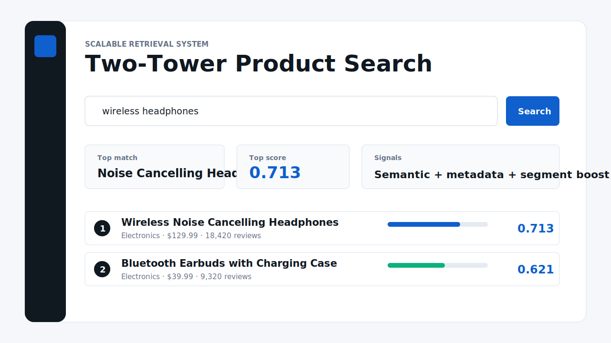
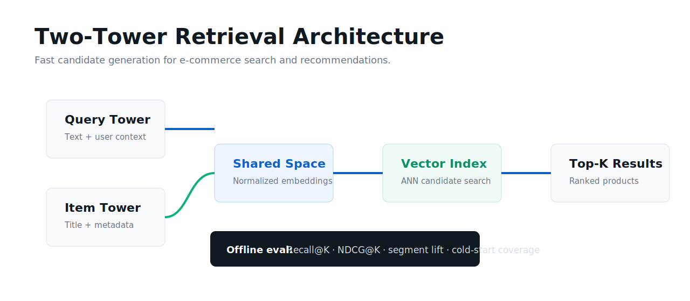

# Building Scalable Retrieval System With Two-Tower Models



A portfolio-grade e-commerce retrieval system that uses a two-tower architecture to match user search queries with product embeddings. The project demonstrates scalable candidate generation, personalization signals, product metadata features, and ranking metrics for shopping search.

The source inspiration is Amazon's public Shopping Queries / ESCI benchmark, which contains difficult shopping queries and query-product relevance judgments. This repo ships with a compact demo catalog so the system runs locally, while the data pipeline and model interfaces are shaped for full ESCI-style training.

## Why This Project Matters

- Two-tower retrieval is the foundation behind fast product search, recommendations, and candidate generation.
- Query and item embeddings can be precomputed separately, making retrieval scalable to large catalogs.
- Metadata signals such as category, price, rating, reviews, and popularity improve product ranking quality.
- Personalization can be layered into the query tower without rebuilding the entire product index.

## Architecture



## What Is Implemented

| Layer | Details |
| --- | --- |
| Query tower | Encodes search text plus user segment and preference signals. |
| Item tower | Encodes product title, category, price bucket, rating, reviews, and popularity. |
| Retrieval service | Scores query embeddings against item embeddings and returns top-k products. |
| Personalization | Boosts preferred categories and price-sensitive shopper behavior. |
| Evaluation | Includes recall@k and NDCG@k helpers for retrieval quality. |
| API | FastAPI `/search` endpoint for query-time retrieval. |
| Frontend | React dashboard with ranked products and signal breakdowns. |
| Training scaffold | PyTorch two-tower model skeleton with in-batch negative loss. |

## Tech Stack

- **ML:** two-tower architecture, feature hashing, contrastive learning scaffold
- **Backend:** FastAPI, Pydantic
- **Frontend:** React, TypeScript, Vite
- **Evaluation:** recall@k, NDCG@k
- **Deployment-ready:** Docker Compose and GitHub Actions CI

## Run Locally

Backend:

```bash
cd backend
python3 -m venv .venv
source .venv/bin/activate
pip install -r requirements.txt
uvicorn app.main:app --reload --port 8320
```

Frontend:

```bash
cd frontend
npm install
VITE_API_URL=http://127.0.0.1:8320 npm run dev
```

Open `http://127.0.0.1:5190` or the Vite URL shown in your terminal.

## API Example

```json
{
  "query": "wireless headphones",
  "segment": "electronics_enthusiast",
  "preferred_categories": ["Electronics"],
  "price_sensitivity": 0.4,
  "top_k": 5
}
```

## Dataset Direction

For a full-scale version, map Amazon Shopping Queries / ESCI fields into:

- query text
- product title and metadata
- ESCI relevance label
- locale or marketplace
- historical interaction signals when available

The included demo data is intentionally small so the app can run instantly in a portfolio review.

## Hiring Manager Signal

This project shows practical retrieval engineering judgment: separate query and item towers, precomputable item embeddings, ANN-ready candidate generation, ranking metrics, and personalization hooks. It is built to explain how scalable search works, not just to display a model file.
